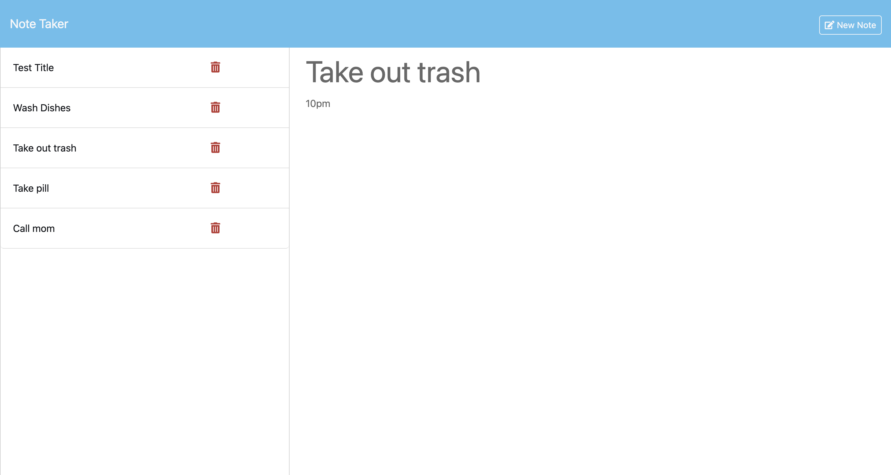
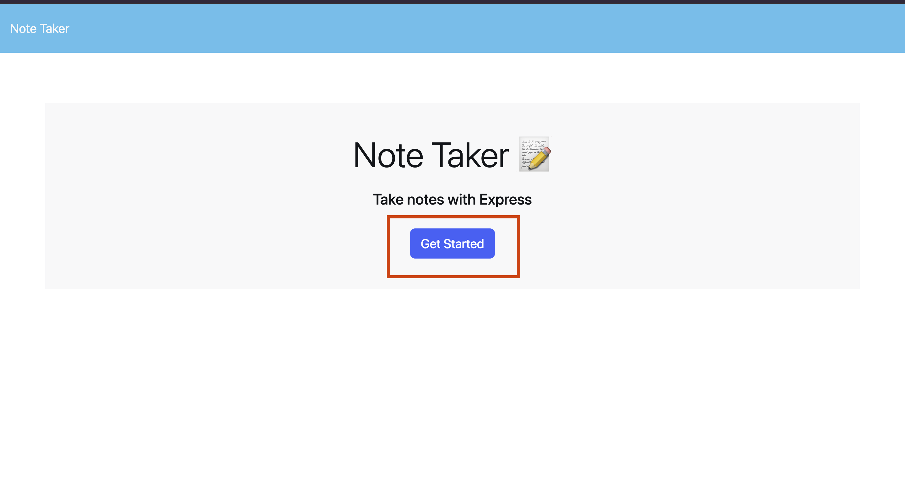
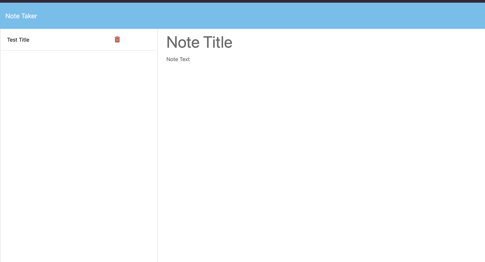
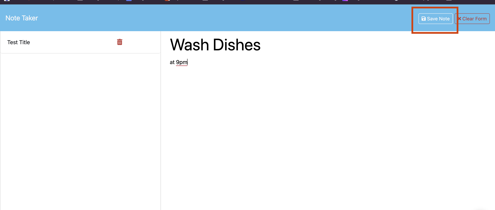

# Note Taker

## Description

This is a simple Note Taker application built with Express.js. The app allows users to create, view, and delete notes by providing a simple interface to quickly write down and organize thoughts and tasks.

[Click here to view the live webpage!](https://marcusmr15-note-taker-565899f027e7.herokuapp.com/)

## Table of Contents

* [Installation](#installation)
* [Usage](#usage)
* [Credits](#credits)
* [License](#license)
* [Tests](#tests)

## Installation

Apart from the deployed application which link was provided in the description, you can also run this application locally! To do so, please follow these steps:

1. Clone the repository:
2. Navigate to the project directory:
3. Install dependencies using `npm i`
4. Start the server by running `node server.js`
5. Open your browser and go to http://localhost:3001 to view the app

## Usage

1. __Click the "Get Started" button__: This action opens the Note Taker application, allowing you to start creating notes.

2. __Enter text into the 'Note Title' and 'Note Text' fields__: Once the Note Taker is open, you can fill in the 'title' and 'text' fields with the content of your note. The 'title' field is for a brief description or title of the note, while the 'text' field is where you can write the detailed content of the note.

3. __Click the save icon (top right)__: After entering your note's title and text, click the save icon located at the top right corner of the application. This action will save your note, preserving the information you've entered.

4. __To add another note, repeat step 1 or click the 'New Note' button__: If you wish to create another note, simply click the + icon also located at the top right corner. This allows you to create multiple notes within the application.
5. __To delete saved notes, click the trash icon__: If you want to remove a note from your list of saved notes, click the trash icon next to the respective note. This action will delete the selected note from the application.

## Credits

This project was created with the help of:
* The _Xpert Learning Assistant_ AI developed by __edX__.
* The _Chat GPT_ AI developed by __Open AI__.
* The starter code from the [miniature-eureka](https://github.com/coding-boot-camp/miniature-eureka) repository by [Xander Rapstine](https://github.com/Xandromus), [John McCambridge](https://github.com/nol166) and [Georgeyoo](https://github.com/Georgeyoo).
* The [Thomas' Express JS Note Taker | UofT Coding Bootcamp: Module 11](https://www.youtube.com/watch?v=-UiqzvUe360) YouTube video.

## License

* This project was created by Marcos Munoz.

## Tests

N/A.
